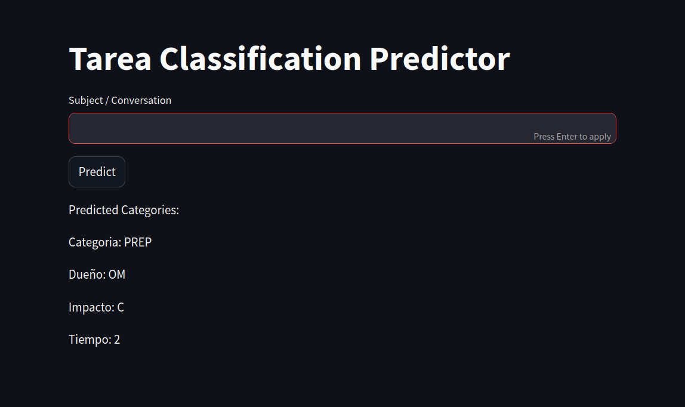

## Hi there 👋, My name is José Manuel
### I am a Junior Data Scientist

  

Welcome to my GitHub profile! I'm a passionate aspiring Data Scientist with a keen interest in uncovering insights from data and leveraging machine learning to solve complex problems. My journey in data science is driven by a love for mathematics, statistics, and programming, and I am constantly exploring new techniques and tools to expand my expertise. Here, you'll find a collection of my projects, including data analysis, visualization, and machine learning models. I'm excited to share my work and collaborate with the community to push the boundaries of data science.

## Technologies
 

 

 
 

 
 
 
 
 

## Skills
> **Programming Languages:** Proficiency in Python and R for data analysis and machine learning.
> 
> **Statistical Analysis:** Strong understanding of statistical methods and their applications.
>
> **Machine Learning:** Experience with machine learning algorithms and frameworks like TensorFlow, Keras, and scikit-learn.
>
> **Data Visualization:** Ability to create compelling visualizations using tools like Matplotlib, Seaborn, and Tableau.
>
> **Data Wrangling:** Skills in data cleaning and preprocessing using libraries such as Pandas and NumPy.
>
> **Database Management:** Knowledge of SQL and NoSQL databases for data extraction and manipulation.
>
> **Big Data Technologies:** Familiarity with Hadoop, Spark, and other big data frameworks.
>
> **Domain Knowledge:** Understanding of the domain you are working in to provide context to your data analysis.
>
> **Communication:** Ability to communicate findings clearly to both technical and non-technical stakeholders.
>
> **Critical Thinking:** Strong problem-solving skills and the ability to approach complex issues with analytical rigor.

## My Relevant Projects 🚀
<!-- Tamaño de las imagenes 1280x720px -->
<table style="width:100%">
  <tr>
    <td>
      
      
Titanic Exploratory Data Analysis

    </td>
    <td>
      
      
Tarea Classification Predictor

    </td>
    <td>
      
      
California Housing Predictor

    </td>
  </tr>
  <tr>
    <td>
      
      
Proyecto 4

    </td>
    <td>
      
      
Proyecto 5

    </td>
    <td>
      
      
Proyecto 6

    </td>
  </tr>
  <tr>
    <td>
      
      
Proyecto 7

    </td>
    <td>
      
      
Proyecto 8

    </td>
    <td>
      
      
Proyecto 9

    </td>
  </tr>
</table>

## Aditional Information
- 🔭 I’m currently working on Data Science Projects 
- 🌱 I’m currently learning Machine Learning Algorithims 
- 📫 How to reach me: josemanuelmartinez2002@gmail.com  
